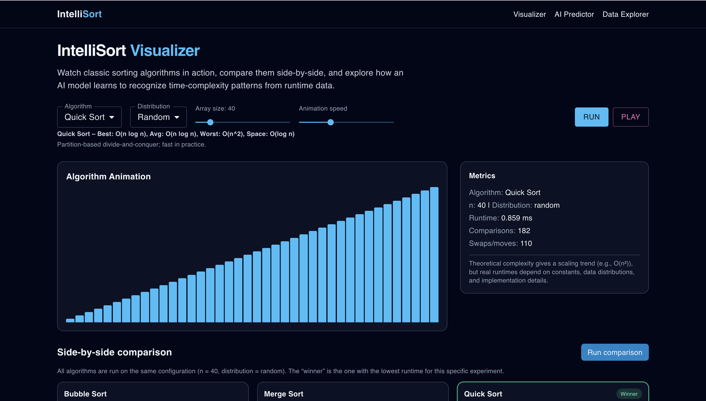
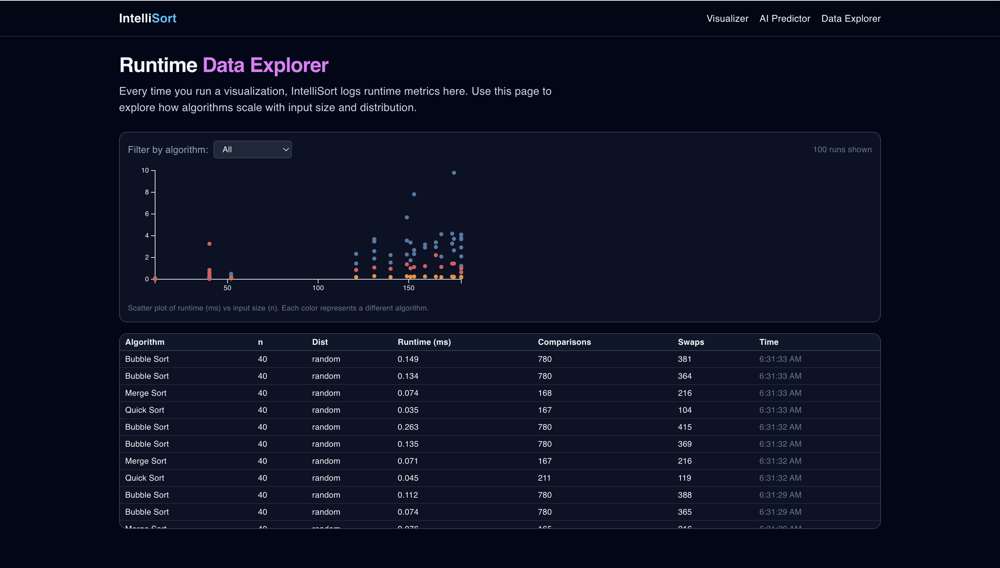

# IntelliSort

<p align="center">
  
</p>

---

<p align="center">

  <!-- Repo metadata -->
  <a href="https://github.com/co-rtex/intellisort/stargazers">
    
  </a>
  <a href="https://github.com/co-rtex/intellisort/network/members">
    
  </a>

  <!-- License -->
  <a href="https://github.com/co-rtex/intellisort/blob/main/LICENSE">
    
  </a>

  <!-- Languages -->
  
  

  <!-- Last commit -->
  

  <!-- Platform -->
  

</p>

---

<p align="center">
  
  
  
  
  
  
  
</p>


Interactive sorting algorithm visualizer + AI-powered runtime prediction.

IntelliSort lets you:
- Watch classic sorting algorithms run step-by-step.
- Compare runtime, comparisons, and swaps across algorithms and input distributions.
- Query an AI model that predicts time-complexity class and estimated runtime for a given input size.

---

## 🔧 Tech Stack

**Frontend**
- Next.js 14 (App Router)
- React 18
- Tailwind CSS
- MUI (Material UI)
- D3.js (for charts)

**Backend**
- FastAPI (Python)
- SQLite (SQLAlchemy ORM)
- scikit-learn (RandomForest classifier + regressor)
- Uvicorn

---

## 🏗 Project Structure

```text
intellisort/
├── backend/
│   ├── main.py              # FastAPI app + endpoints
│   ├── models.py            # SQLAlchemy models (AlgorithmRun)
│   ├── schemas.py           # Pydantic schemas
│   ├── database.py          # DB engine + session
│   ├── sorting/
│   │   └── algorithms.py    # Sorting algorithms + array generators
│   └── ml/
│       └── runtime_model.py # Synthetic data + ML model training & prediction
└── frontend/
    ├── app/
    │   ├── page.tsx         # Visualizer page
    │   └── predict/page.tsx # AI predictor page
    ├── components/          # React components (Navbar, controls, charts, etc.)
    ├── lib/api.ts           # API client for backend
    └── theme.ts             # MUI dark theme

'''

## 📸 Screenshots

### Algorithm Visualizer


### AI Runtime Predictor


### Data Explorer

